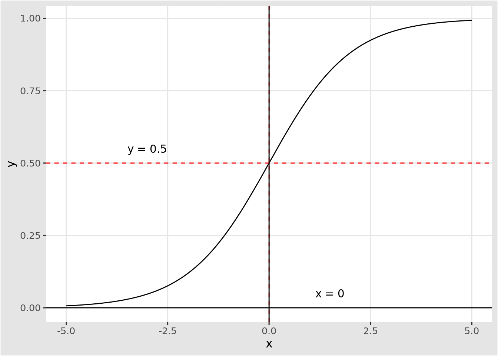

# `Dataset`과 `Dataloader` 클래스

이번 챕터에서는 실제 딥러닝을 사용하여 모델링을 할 때 사용될 데이터를 어떻게 `torch`에 넣을수 있는지에 대하여 알아보자. 이 과정에서 우리가 알아야하는 클래스가 두개가 있는데, 바로 `Dataset` 클래스와 `Dataloader` 클래스이다.

## 예제 데이터

언제나 그렇듯, 본 공략집은 예제를 통해서 설명하는 것을 선호한다. 이번 챕터에서는 가상의 학생들의 공부시간과 연습한 문제 갯수, 그리고 시험의 합격 여부에 대한 자료를 만들어보았다.


```r
library(torch)
library(tidyverse)

set.seed(2021)

# 독립변수 발생
x1 <- c(rnorm(300, 5, 2), rnorm(200, 10, 2))
x2 <- as.integer(pmax(c(rnorm(300, 10, 2), rnorm(200, 13, 2)), 0))

# 종속변수 발생
y <- rep(c(0, 1), c(300, 200))

# 데이터 프레임 만들기
study_data <- tibble(study_time = x1,
                     n_question = x2,
                     pass_exam = y)

# 뒤섞기
study_data <- study_data[sample(500, 500),]

knitr::kable(head(study_data), format="html",
             caption = "`study_data` 구조") %>% 
  kableExtra::kable_styling(bootstrap_options = "striped",
                            full_width = F)
```

<table class="table table-striped" style="width: auto !important; margin-left: auto; margin-right: auto;">
<caption>(\#tab:unnamed-chunk-1)`study_data` 구조</caption>
 <thead>
  <tr>
   <th style="text-align:right;"> study_time </th>
   <th style="text-align:right;"> n_question </th>
   <th style="text-align:right;"> pass_exam </th>
  </tr>
 </thead>
<tbody>
  <tr>
   <td style="text-align:right;"> 4.376114 </td>
   <td style="text-align:right;"> 9 </td>
   <td style="text-align:right;"> 0 </td>
  </tr>
  <tr>
   <td style="text-align:right;"> 9.305141 </td>
   <td style="text-align:right;"> 15 </td>
   <td style="text-align:right;"> 1 </td>
  </tr>
  <tr>
   <td style="text-align:right;"> 3.790936 </td>
   <td style="text-align:right;"> 9 </td>
   <td style="text-align:right;"> 0 </td>
  </tr>
  <tr>
   <td style="text-align:right;"> 5.879647 </td>
   <td style="text-align:right;"> 7 </td>
   <td style="text-align:right;"> 0 </td>
  </tr>
  <tr>
   <td style="text-align:right;"> 1.166191 </td>
   <td style="text-align:right;"> 7 </td>
   <td style="text-align:right;"> 0 </td>
  </tr>
  <tr>
   <td style="text-align:right;"> 9.976015 </td>
   <td style="text-align:right;"> 11 </td>
   <td style="text-align:right;"> 1 </td>
  </tr>
</tbody>
</table>

### 데이터 나누기

이전 챕터에서 우리는 전체 데이터를 모두 사용하여 신경망을 학습했었다. 하지만, 이럴 경우 과적합의 문제가 발생하기 때문에 언제 학습을 할 때, 우리 모델이 새로운 데이터에 얼마나 잘 되어있는지, 혹시 학습이 과적합은 일어나고 있는게 아닌지 판단해야 한다. 이런 것들을 하기 위해서 주어진 데이터를 두 개로 쪼갠다; 하나는 학습용(train data set), 하나는 평가용(test data set)으로 나눈다.

다음의 코드는 주어진 `study_data`의 70%는 학습용, 30%는 평가용으로 나누는 코드이다.


```r
library(rsample)

set.seed(2021)
splited_data <- initial_split(study_data, prop = 0.7)
train_data <- training(splited_data)
test_data <- testing(splited_data)

train_data %>% dim()
```

```
#> [1] 350   3
```

```r
test_data %>% dim()
```

```
#> [1] 150   3
```

### 시각화

학습용 데이터를 사용하여 데이터를 시각화보면 다음과 같다.

<div class="figure" style="text-align: center">

<p class="caption">(\#fig:unnamed-chunk-3)`study_data` 학습용 데이터(train data) 시각화</p>
</div>

## `Dataset` 클래스

`Dataset` 클래스는 우리가 가지고 있는 데이터를 `torch`에서 접근할 때 어떻게 접근을 해야하는지 알려줄때 사용한다. 예를 들어, 예제 데이터와 같이 행과 열로 구성된 데이터에서 어떤 열이 독립변수(independant variables)를 의미하고 있는지, 어떤 열이 종속변수(dependant variable)를 의미하는지 알려줘야하고, 만약 모델에 넣기 전, 특정 전처리가 필요하다면, 그 과정 역시 넣어줄 수 있다.

다음은 `dataset` 함수를 사용하여 `study_dataset` 클래스 생성자를 정의하는 코드이다. 일단 `study_dataset` 생성자는 객체를 만들때, `R6`에서처럼 클래스 `initialize`가 실행된다. 이것을 통하여 `prepare_data()` 함수가 실행되고, 결과값이 클래스의 `data`로 저장된다.


```r
study_dataset <- dataset(
    name = "study_dataset",
    initialize = function() {
        self$data <- self$prepare_data()
    },
    
    .getitem = function(index) {
        # 독립변수 x, 종속변수 y
        x <- self$data[index, 1:2]
        y <- self$data[index, 3]
        
        list(x, y)
    },
    
    .length = function() {
        self$data$size()[[1]]
    },
    
    prepare_data = function() {
        # 난수고정
        set.seed(2021)
        
        split_data <- rsample::initial_split(study_data, prop = 0.7)
        train_data <- training(split_data)

        torch_tensor(as.matrix(train_data))
    }
)
```

위의 코드를 살펴보면 `prepare_data()` 함수는 앞에서 살펴본 `R` 코드를 응용하여 `study_data` 데이터셋 (R 환경에 정의되어 있는 데이터)을 가져다가 `rsample` 패키지의 `initial_split()` 함수를 사용해서 학습용 데이터셋을 분리한 후 `torch_tensor()`를 사용해서 `torch`로 넘겨준다는 것을 알 수 있다. 그리고, `.getitem()`과 `.length()`의 멤버함수를 통하여 데이터에 접근할 수 있도록 만들어져 있다. 정의된 `study_dataset()` 클래스 생성자를 통하여 데이터를 만들어보자.


```r
torch_data <- study_dataset()
torch_data
```

```
#> <study_dataset>
#>   Inherits from: <dataset>
#>   Public:
#>     .getitem: function (index) 
#>     .length: function () 
#>     clone: function (deep = FALSE) 
#>     data: torch_tensor, R7
#>     initialize: function () 
#>     prepare_data: function ()
```

결과를 살펴보면 앞에서 정의한 `study_dataset()` 클래스 생성자 안의 멤버 함수들이 리스트로 제공되는 것을 알 수 있다. `.getitem()` 멤버함수는 색인(index)을 입력 변수로 받는 함수인데, 입력된 색인 값에 대응되는 데이터를 반환한다. 다음의 코드를 통하여 `train_data`가 `torch_data`에 그대로 전달 잘 되었다는 것을 확인할 수 있다.


```r
torch_data$.getitem(1:6)
```

```
#> [[1]]
#> torch_tensor
#>   9.3051  15.0000
#>   3.7909   9.0000
#>   5.8796   7.0000
#>   1.1662   7.0000
#>   9.9760  11.0000
#>  11.7531   9.0000
#> [ CPUFloatType{6,2} ]
#> 
#> [[2]]
#> torch_tensor
#>  1
#>  0
#>  0
#>  0
#>  1
#>  1
#> [ CPUFloatType{6} ]
```

```r
head(train_data)
```

```
#> # A tibble: 6 x 3
#>   study_time n_question pass_exam
#>        <dbl>      <int>     <dbl>
#> 1       9.31         15         1
#> 2       3.79          9         0
#> 3       5.88          7         0
#> 4       1.17          7         0
#> 5       9.98         11         1
#> 6      11.8           9         1
```

## 데이터로더 (Dataloader) 클래스

`study_dataset()` 생성자를 통하여 데이터를 `torch` 상에서 접근하도록 만들었다. 앞선 신경망 학습 예제에서 신경망을 학습할 때, 주어진 데이터 전체를 사용하여 미분값(gradient)을 구했다. 하지만, 실제 많은 딥러닝 문제의 경우 데이터의 크기가 너무 커서 한꺼번에 모든 표본을 메모리에 올린 후 학습을 하지 않고, 잘게 쪼갠 여러 개의 배치(batch)를 만든 뒤에 학습을 진행한다.

다음 차례는 torch에서 신경망을 학습시킬때 데이터의 부분부분을 잘라서 접근 할 수 있도록 만들어 줘야하는데, 이 부분은 `dataloader` 클래스에서 담당하고 있다. 다음의 코드는 앞에서 정의한 `torch_data`를 학습할 때 한번에 불러오는 표본 갯수(batch_size)를 8개로 설정한다.


```r
study_dl <- dataloader(torch_data, batch_size = 8)
```

8개를 기준으로 한 세트를 이루므로, 전체 350개의 표본은 총 44개의 `batch`로 이루어져 있다는 것을 확인 할 수 있다. 

<div class="rmdwarning">
<h3 id="주의하기">주의하기</h3>
<p>마지막 배치의 경우는 8개가 아닌 6개의 표본들로 이루어져 있다는 것도 짐작할 수 있어야 한다.</p>
</div>


```r
# 350/8 == 43.75
# 350 %% 8 == 6
study_dl$.length()
```

```
#> [1] 44
```

이렇게 `study_dl` 안에 들어있는 각각의 데이터 조각들에 접근을 하기 위해서는 `enumerate()` 함수를 사용한다. 이 함수에 `study_dl`을 넣어보면 전체 44개의 원소를 가진 리스트 안에 각각의 배치들이 들어가 있는 것을 확인 할 수 있다.


```r
enumerate(study_dl) %>% length()
```

```
#> [1] 44
```

```r
enumerate(study_dl)[1:2]
```

```
#> [[1]]
#> <environment: 0x563186ce0468>
#> attr(,"class")
#> [1] "enum_env"
#> 
#> [[2]]
#> <environment: 0x563186ce23c0>
#> attr(,"class")
#> [1] "enum_env"
```

## 모델 설정 - 로지스틱 회귀모형

자료를 `torch`에 보내고, 어떻게 접근하는지까지 알아보았다. 이번에는 분류 문제를 푸는 통계 모델 중에서 가장 유명한 모델인 로지스틱 회귀모형을 `torch`로 정의해보자. 로지스틱 회귀모형은 일반화 선형모형(GLM)의 한 종류이다. 이름에서도 느껴지겠지만, 이 모형은 선형모형의 연장선에 있다. 왜 연장선 상에 있다고 하는 것일까?

일반적인 회귀모형에서는 종속변수인 $Y$값이 정규분포를 따른다고 가정한다. 왜냐하면 데이터의 발생이 다음과 같은 가정에서 출발하기 때문이다.

$$
Y = X \beta + \epsilon,  \quad \epsilon \sim \mathcal{N}(0, \sigma^2I)
$$

이것을 $Y$의 입장에서 생각해보면, 결국 $Y$라는 확률변수는 정규분포를 따르고, $X$가 정해졌을때의 평균값은 $X\beta$가 된다.

$$
Y \sim \mathcal{N}(X\beta, \sigma^2 I)
$$
따라서, 다음의 관계가 성립하게 된다.

$$
\mathbb{E}[Y|X] = X\beta = f(X\beta)
$$

위의 등식에서 $f(x)$는 $f(x)=x$인 항등함수(identity function)를 나타낸다. 즉, 일반적인 회귀모형의 경우, 종속변수 $Y$를 정규분포를 따르는 확률변수로 생각하고 있고, 그 평균과 $X\beta$를 항등함수로 이어놓은 형태인 것이다. 만약 우리가 종속변수를 다른 확률변수라고 생각하고, 그것의 평균을 이어주는 어떤 함수 $f$를 찾는다면 어떨까?

수리 통계학에서 가장 먼저 배우는 함수 중 하나가 바로 0과 1을 갖는 베르누이 확률변수인데, 베르누이 확률변수의 평균은 바로 1이 나오는 확률을 의미하는 $p$이다. $p$값이 그 의미상 0과 1사이에 위치해야 하므로, $X\beta$에서 나오는 값들을 0과 1사이로 모아줘야 하는데 여기서 시그모이드(sigmoid) 함수, $\sigma(x)$,를 사용한다.

$$
f(x) := \sigma(x) = \frac{e^x}{1+e^x}
$$

따라서, 로지스틱 회귀모형에서 종속변수 $Y$는 다음과 같이 모수 $\sigma(X\beta)$인 베르누이 확률변수를 따른다고 생각하면 된다.

$$
Y \sim Bernulli(\sigma(X\beta))
$$

<div class="rmdnote">
<h3 id="알아두기">알아두기</h3>
<p>로지스틱 회귀모형은 종속변수를 베르누이 확률변수로 가정하고, 그것의 평균인 <span class="math inline">\(p\)</span>와 <span class="math inline">\(X\beta\)</span>를 시그모이드(sigmoid) 함수로 이어놓은 형태로 볼 수 있다.</p>
</div>


문제는 왜 그럼 로지스틱 회귀모형인가 하는건데, [사실은 시그모이드(sigmoid) 함수가 바로 로지스틱 함수이기 때문이다.](https://en.wikipedia.org/wiki/Sigmoid_function) 좀 더 엄밀하게 말하면 우리가 알고 있는 시그모이드 함수의 정확한 명칭은 로지스틱 함수이고, 시그모이드 함수는 S 자 곡선 형태를 띄는 함수들을 통칭해서 부르는 말이다. 우리가 딥러닝에서 많이 쓰는 활성함수(activation function)중 하나인 `Hyperbolic tangent` 역시 시그모이드 함수이다.

<div class="rmdwarning">
<h3 id="주의하기">주의하기</h3>
<p>우리가 알고 있는 시그모이드(sigmoid) 함수의 정확한 명칭은 로지스틱(logistic) 함수이다.</p>
</div>

### torch 코드 구현

이제 `torch`로 특정 신경망 구조를 구현하는 코드는 익숙해졌으리라고 생각한다. 로지스틱 회귀모형은 단층 모형이고, 마지막 활성함수를 `sigmoid()` 함수로 감싸줘야하는 것이 특징이다.


```r
study_net <- nn_module(
    "StudyNet",
    initialize = function() {
        self$fc1 <- nn_linear(2, 1)
        self$sigmoid <- nn_sigmoid()
    },
    forward = function(x) {
        x %>%
            self$fc1() %>%
            self$sigmoid()
    }
)

logistic_reg <- study_net()
logistic_reg
```

```
#> An `nn_module` containing 3 parameters.
#> 
#> ── Modules ─────────────────────────────────────────────────────────────────────
#> ● fc1: <nn_linear> #3 parameters
#> ● sigmoid: <nn_sigmoid> #0 parameters
```

```r
logistic_reg$parameters
```

```
#> $fc1.weight
#> torch_tensor
#> -0.2411  0.0127
#> [ CPUFloatType{1,2} ]
#> 
#> $fc1.bias
#> torch_tensor
#> -0.2450
#> [ CPUFloatType{1} ]
```

코드에서 볼 수 있다시피, 로지스틱 회귀모형은 입력값을 독립변수 갯수인 2개로 받고, 출력값은 하나로 나가는 모형이다. 마지막 층에 `sigmoid()` 함수는 마지막 출력값을 0과 1사이로 보내기 위하여 사용되었다. 최적화 알고리즘은 `optim_sgd`으로 설정하였다. 


```r
optimizer <- optim_sgd(logistic_reg$parameters, lr = 0.05)
```

### 손실함수 설정

로지스틱 회귀모형의 구현에서 핵심 파트는 손실함수(loss function)를 설정하는 부분이다. 앞에서 로지스틱 회귀모형이 종속변수 $Y$를 베르누이 확률변수(Bernoulli random variable)로 모델링을 한다는 것을 살펴보았다.

로지스틱 회귀분석의 계수를 구하기 위해서는 우도함수(Likelihood function)를 정의한 후, 그것을 최대로 만드는 최대우도 추정량(Maximum likelihood estimator; MLE) 값을 찾아야 한다.

확률변서 $Y$가 베르누이 확률변수를 따를 때, 확률질량함수(p.m.f)는 다음과 같다.

$$
f_Y(y; p) = p^{y}(1-p)^{1-y}, \text{ for }y = 1, 0, \text{ and } 0 \le p \le 1.
$$
따라서, 로지스틱 회귀모형의 가정을 위의 확률질량함수와 같이 생각해보면, 주어진 데이터에 대한 우도함수 $p$는 다음과 같다.

$$
\begin{align}
p\left(\beta|\mathbf{X}, \underline{y}\right) & =\prod_{i=1}^{n}p\left(\beta|\mathbf{x}_{i},y_{i}\right)\\
 & =\prod_{i=1}^{n}\sigma\left(\mathbf{x}_{i}^{T}\beta\right)^{y_{i}}\left(1-\sigma\left(\mathbf{x}_{i}^{T}\beta\right)\right)^{1-y_{i}}\\
 & =\prod_{i=1}^{n}\pi_{i}^{y_{i}}\left(1-\pi_{i}\right)^{1-y_{i}}
\end{align}
$$
위의 수식에서 계산의 편의를 위하여 $\pi_i$를 사용하여 다음의 항을 간단히 표현했음에 주의한다.

$$
\pi_{i}:=\sigma\left(\mathbf{x}_{i}^{T}\beta\right)
$$

보통의 최적화 알고리즘의 경우, 손실함수 값을 최소로 만드는 값을 찾는 알고리즘이다. 하지만 MLE의 경우 주어진 우도함수를 최대로 만드는 값이기 때문에 최적화 알고리즘에 사용할 수 있도록 음수값을 붙여주고, 함수를 좀 더 완만하게 만들기 위해서 로그값을 취해준, 음우도함수(negative log-likelihood function)을 사용한다.

$$
\begin{align*}
-\ell\left(\beta\right) & =-log\left(p\left(\underline{y}|\mathbf{X},\beta\right)\right)\\
 & =-\sum_{i=1}^{n}\left\{ y_{i}log\left(\sigma\left(\mathbf{x}_{i}^{T}\beta\right)\right)+\left(1-y_{i}\right)log\left(1-\sigma\left(\mathbf{x}_{i}^{T}\beta\right)\right)\right\} \\
 & =-\sum_{i=1}^{n}\left\{ y_{i}log\left(\pi_{i}\right)+\left(1-y_{i}\right)log\left(1-\pi_{i}\right)\right\}
\end{align*}
$$

위의 함수 $-\ell(\cdot)$은 `torch`에서 `nnf_binary_cross_entropy()` 함수에 정의되어 있다. 따라서 로지스틱 회귀모형의 계수는 다음과 같이 데이터 행렬($X$)과 레이블($y$)가 주어졌을때 $-\ell(\cdot)$ 함수를 최소로 만드는 $\beta$값으로 표현된다.

$$
\hat{\beta} \overset{set}{=} \underset{\beta}{arg \ min} \ \ -\ell\left(\beta; X, y\right)
$$
이 값을 찾기 위해서 경사하강법을 이용해 $\hat{\beta}$을 찾아나아가는 과정이 `torch`에서는 단 두 줄로 표현이 된다.


```r
loss <- nnf_binary_cross_entropy(output, batch[[2]])
loss$backward()
optimizer$step()
```

앞에서 정의한 `study_dl` 데이터로더를 사용하여 로지스틱 회귀모형을 학습시키는 코드는 다음과 같다.


```r
for (epoch in 1:700) {
  
  loss_collect <- c()
  
  for (batch in enumerate(study_dl)) {
    optimizer$zero_grad()
    output <- logistic_reg(batch[[1]])
    loss <- nnf_binary_cross_entropy(output, batch[[2]])
    loss$backward()
    optimizer$step()
    loss_collect <- c(loss_collect, loss$item())
  }
  
  if (epoch %% 100 == 0){
      cat(sprintf("Loss at epoch %d: %3f\n", epoch, mean(loss_collect)))    
  }
}
```

```
#> Loss at epoch 100: 0.255531
#> Loss at epoch 200: 0.220138
#> Loss at epoch 300: 0.209447
#> Loss at epoch 400: 0.204981
#> Loss at epoch 500: 0.202872
#> Loss at epoch 600: 0.201842
#> Loss at epoch 700: 0.201364
```

## 학습 결과

학습된 계수 값을 다음과 같다.


```r
logistic_reg$parameters
```

```
#> $fc1.weight
#> torch_tensor
#>  1.1832  0.5823
#> [ CPUFloatType{1,2} ]
#> 
#> $fc1.bias
#> torch_tensor
#> -15.7891
#> [ CPUFloatType{1} ]
```


### 평가셋 예측

학습된 로지스틱 회귀모형의 계수값을 사용하여 평가셋의 반응 변수가 1일 확률, 즉, 시험에 통과할 확률을 예측 할 수 있다.


```r
test_data <- testing(splited_data)
test_data[,1:2] %>%
  # R to torch
  as.matrix() %>% 
  torch_tensor() %>%
  # prop. prediction
  logistic_reg() %>%
  # torch to R
  as.array() %>% as.numeric()-> predict
```

예측한 확률값이 0.5가 넘을 경우, 학생이 시험에 통과를 할 수 있다고 예측을 하고, 그렇지 않을 경우 통과하지 못한다고 예측해보자.


```r
# make 0 and 1 using 0.5 threshold
predict <- floor(predict - 0.5) + 1
head(predict)
```

```
#> [1] 0 0 0 0 1 0
```

이렇게 예측한 값과 실제 평가셋에 들어있는 학생들의 시험 통과 여부값을 사용하여 결과 비교하여 표로 만들어보면 다음과 같다.

<table class="table table-striped" style="width: auto !important; margin-left: auto; margin-right: auto;">
<caption>(\#tab:unnamed-chunk-19)평가셋을 통한 모델성능 비교 (p = 0.5)</caption>
 <thead>
<tr>
<th style="empty-cells: hide;border-bottom:hidden;" colspan="1"></th>
<th style="border-bottom:hidden;padding-bottom:0; padding-left:3px;padding-right:3px;text-align: center; " colspan="3"><div style="border-bottom: 1px solid #ddd; padding-bottom: 5px; ">예측</div></th>
</tr>
  <tr>
   <th style="text-align:left;">   </th>
   <th style="text-align:right;"> 불합격 </th>
   <th style="text-align:right;"> 합격 </th>
   <th style="text-align:right;"> 총계 </th>
  </tr>
 </thead>
<tbody>
  <tr grouplength="3"><td colspan="4" style="border-bottom: 1px solid;"><strong>실제값</strong></td></tr>
<tr>
   <td style="text-align:left;padding-left: 2em;" indentlevel="1"> 불합격 </td>
   <td style="text-align:right;"> 87 </td>
   <td style="text-align:right;"> 0 </td>
   <td style="text-align:right;"> 87 </td>
  </tr>
  <tr>
   <td style="text-align:left;padding-left: 2em;" indentlevel="1"> 합격 </td>
   <td style="text-align:right;"> 6 </td>
   <td style="text-align:right;"> 57 </td>
   <td style="text-align:right;"> 63 </td>
  </tr>
  <tr>
   <td style="text-align:left;padding-left: 2em;" indentlevel="1"> 총계 </td>
   <td style="text-align:right;"> 93 </td>
   <td style="text-align:right;"> 57 </td>
   <td style="text-align:right;"> 150 </td>
  </tr>
</tbody>
</table>

아래 그림에서처럼 로지스틱 함수는 입력값이 0일때 함수값이 0.5가 된다. 즉, 로지스틱 회귀에서 $X\beta$값이 로지스틱 함수에 입력이 되므로, $X\beta$ 값이 0이 되는 값들을 경계로 모델의 합격 불합격 예측값이 갈리는 것이다. 

<div class="figure" style="text-align: center">

<p class="caption">(\#fig:logistic-fcn)로지스틱 함수는 x가 0일때 0.5를 지나게 된다.</p>
</div>
이러한 선을 의사결정선(decision boundary)라고 부른다.

$$
\hat{\beta}_0 + \hat{\beta}_1 x_1 + \hat{\beta}_2 x_2  = 0
$$

주어진 예제의 평가셋을 시각화 시키고, 학습한 계수를 바탕으로 의사결정선을 구해보면 다음과 같다.


```r
learned_beta <- logistic_reg$parameters$fc1.weight %>% as.numeric()
learned_bias <- logistic_reg$parameters$fc1.bias %>% as.numeric()
addline <- function(beta, bias, ...){
  my_slope <- -beta[1] / beta[2]
  my_intercept <- -bias / beta[2]
  geom_abline(slope = my_slope,
              intercept = my_intercept, ...)
}

p_data <- ggplot(data = test_data) +
  geom_point(mapping =
               aes(x = study_time,
                   y = n_question,
               color = factor(pass_exam))) +
  xlab("Study time") +
  ylab("Number of Question") +
  scale_colour_discrete(guide = guide_legend(reverse=TRUE),
                        name="Exam",
                        labels=c("Fail", "Success"))

p_data + 
  addline(learned_beta, learned_bias,
          linetype = "solid", col = "blue")
```


